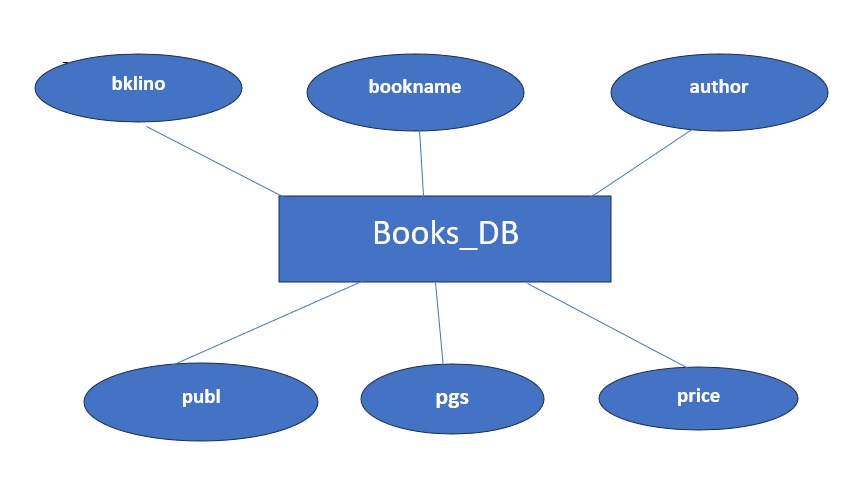

# Ex02 Django ORM Web Application
## Date: 28-02-2024

## AIM
To develop a Django application to store and retrieve data from a Book database using Object Relational Mapping(ORM).

## Entity Relationship Diagram



## DESIGN STEPS

### STEP 1:
Clone the problem from GitHub

### STEP 2:
Create a new app in Django project

### STEP 3:
Enter the code for admin.py and models.py

### STEP 4:
Execute Django admin and create details for 10 books

## PROGRAM

```
models.py:

from django.db import models
from django.contrib import admin
class Books_DB(models.Model):
    bklino=models.IntegerField(primary_key="bklino");
    bookname=models.CharField(max_length=30);
    author=models.CharField(max_length=20);
    publ=models.CharField(max_length=20);
    pgs=models.IntegerField();
    price=models.IntegerField();
class Books_DBAdmin(admin.ModelAdmin):
    list_display=("bklino","bookname","author","publ","pgs","price");


admin.py:

from django.contrib import admin
from .models import Books_DB,Books_DBAdmin
admin.site.register(Books_DB,Books_DBAdmin)
```

## OUTPUT


## RESULT
Thus the program for creating a database using ORM hass been executed successfully
